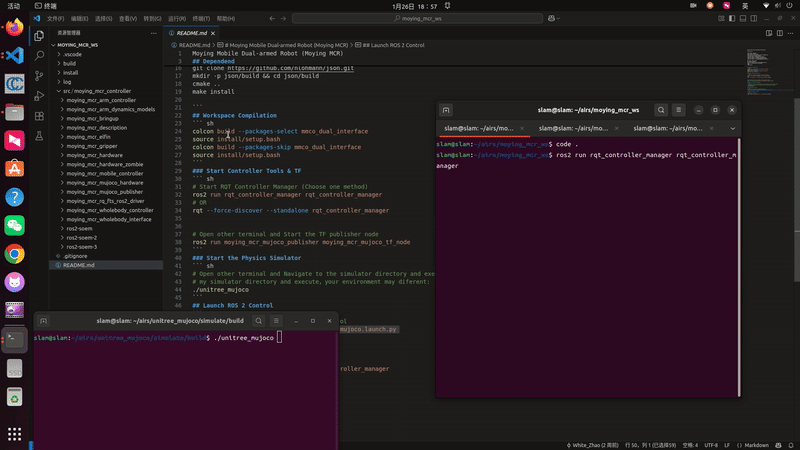
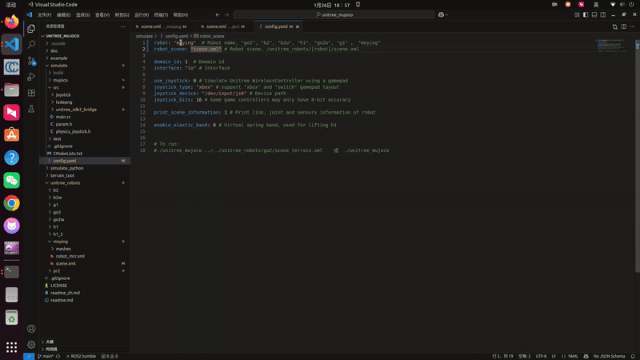

Moying Mobile Dual-armed Robot (Moying MCR)
===
## Dependend
```
pip3 install wxpython
pip3 install transforms3d
sudo apt-get install build-essential libgtk-3-dev
sudo apt install libyaml-cpp-dev
sudo apt install ros-humble-ros2-control
sudo apt install ros-humble-ros2-controllers
sudo apt install -y ros-humble-gazebo-ros-pkgs
sudo apt install -y ros-humble-gazebo-ros2-control

## find a install path
## install nlohmann
git clone https://github.com/nlohmann/json.git
mkdir -p json/build && cd json/build
cmake ..
make install

```
## Workspace Compilation
``` sh
colcon build --packages-select mmco_dual_interface
source install/setup.bash
colcon build --packages-skip mmco_dual_interface
source install/setup.bash
```
### Start Controller Tools & TF
``` sh
# Start RQT Controller Manager (Choose one method)
ros2 run rqt_controller_manager rqt_controller_manager
# OR
rqt --force-discover --standalone rqt_controller_manager


# Open other terminal and Start the TF publisher node
ros2 run moying_mcr_mujoco_publisher moying_mcr_mujoco_tf_node
```
### Start the Physics Simulator
``` sh
# Open other terminal and Navigate to the simulator directory and execute:
# my simulator directory and execute，your environment may diferent:
./unitree_mujoco
```
#### Instruction Guide

#### Command Execution

#### Related Settings


## Launch ROS 2 Control
``` sh
# Open other terminal and Launch MCR control
ros2 launch moying_mcr_bringup moying_mcr_mujoco.launch.py
```
#### Results Display

## Verify Controller Status
``` sh
# Open other terminal
ros2 control list_controllers -c /mcr/controller_manager
```

